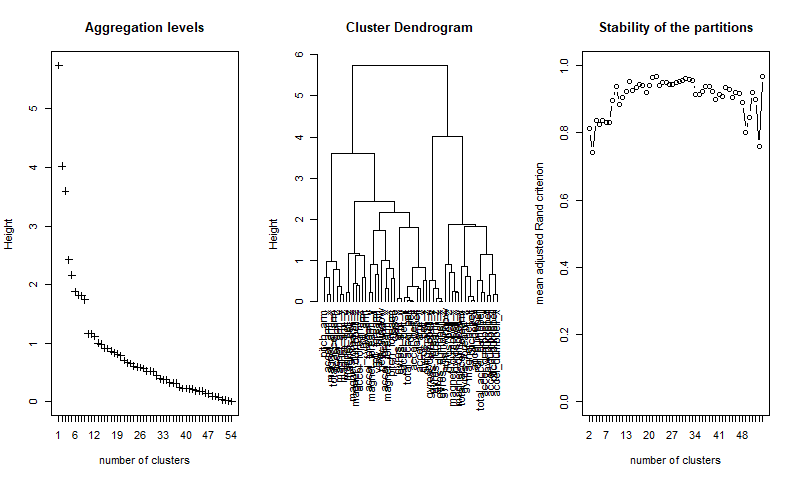
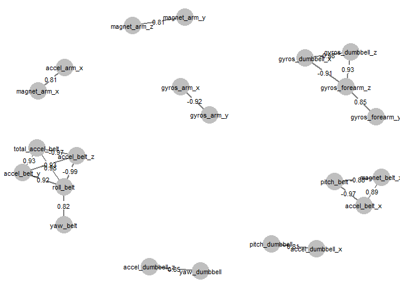
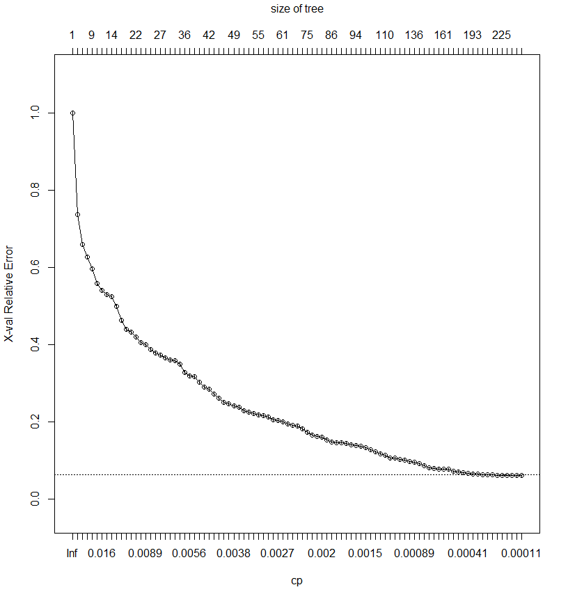
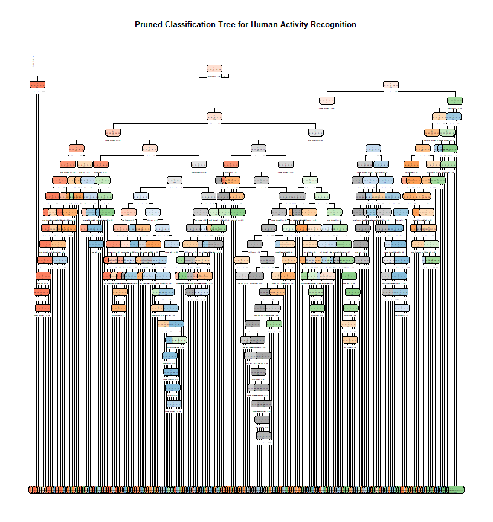
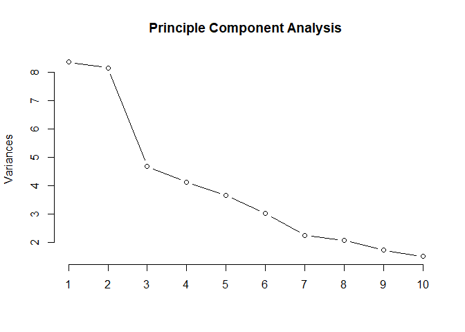

Executive Summary
-----------------

One thing that people regularly do is quantify how much of a particular
activity they do, but they rarely quantify how well they do it. In this
project, we analyzed and used the data from accelerometers on the belt,
forearm, arm, and dumbell of 6 participants to exgract a smaller set of
feature variables and use them to develop a decision tree based model to
predict or recognize the quality of participants' activities. The model
achieved 95% accuracy with 20 test cases.

Background
----------

Using devices such as Jawbone Up, Nike FuelBand, and Fitbit it is now
possible to collect a large amount of data about personal activity
relatively inexpensively. These types of devices are part of the
quantified self movement – a group of enthusiasts who take measurements
about themselves regularly to improve their health, to find patterns in
their behavior.

One thing that people regularly do is quantify how much of a particular
activity they do, but they rarely quantify how well they do it. In this
project, our goal will be to use data from accelerometers on the belt,
forearm, arm, and dumbell of 6 participants to predict the manner in
which people did the exercise.

Our analysis plan will be identify all of subset of the variables in the
training set to predict the manner in which people did the exercise as
indicated by the "classe" variable. We will also conduct cross
validation to evaluate and select a prediction model with better
performance based on the expected out of sample error.

Data Processing
---------------

We replaced entries with the value "\#DIV/0!" and then removed columns
whose rows are almost all with Null/NA values - columns names starting
with var\_, stddev\_, min\_, max\_, avg\_ and amplitude\_.

We also removed the first 5 columns with record id, participant's name
and the date and time data were collected. This leaves us 55 variables
including the target variable classe, representing five different
activity fashions.

Young health participants withj specified range of age were asked to
perform one set of 10 repetitions of the Unilateral Dumbbell Biceps Curl
in five different fashions: exactly according to the specification
(Class A), throwing the elbows to the front (Class B), lifting the
dumbbell only halfway (Class C), lowering the dumbbell only halfway
(Class D) and throwing the hips to the front (Class E).

    setwd("E:/Coursera/Specializations/Data_Science_JHU/C08_Practical_Machine_Learning/Project")
    library(dplyr)
    library(magrittr)

    # Replace the character value "#DIV/0!" with a NA.
    training <- read.csv("./pml-training.csv",na.strings = c("#DIV/0!"))

    # Remove columns whose rows are with complete or majority NA values
    training <- training[,colSums(is.na(training))==0]

    # Remove var_xxx, stddev_xxx, min_, max_, avg_ and amplitude_ columns
    # whose rows are almost all with NA values
    stdcols<-grep("^stddev_*",colnames(training))
    varcols<-grep("^var_*",colnames(training))
    mincols<-grep("^min_*",colnames(training))
    maxcols<-grep("^max_*",colnames(training))
    avgcols<-grep("^avg_*",colnames(training))
    ampcols<-grep("^amplitude_*",colnames(training))

    training <- training[,-c(varcols,stdcols,maxcols,mincols,avgcols,ampcols)]

    # remove columns X, user_name, raw_timestamp_part_1,
    # raw_timestamp_part_2, cvtd_timestamp
    training <- training[,-c(1:5)]
    dim(training)

    ## [1] 19622    55

    table(training$classe)

    ## 
    ##    A    B    C    D    E 
    ## 5580 3797 3422 3216 3607

Hierarchical Clustering Analysis
--------------------------------

I used hierarchical clustering to seek out patterns in the variables
using a dendrogram (tree diagram) to show how closely each of the
variables are related.

I also applied another method of estimating the number of clusters, a
“stability” plot, to estimate the number of clusters. The plot is
derived from evaluating the stability of partitions obtained from a
hierarchy of p variables.

Look at the peaks in the plot below. The maximum for stability is 1.0,
so the higer the peak, the better. In this case, the plot seems to
suggest 30-ish stable partitions are present to explain 90-ish% of the
total variance in the data. This led to the focus of my next section to
identify a smaller set of feature variables that is later shown to be
sufficient to render good predicting power in predicting new cases.

    library(ClustOfVar)
    library(cluster)
    library(caret)
    library(PCAmixdata)
    split <- splitmix(training)
    X1 <- split$X.quanti #(Gives numerical columns in the dataset) 
    X2 <- split$X.quali  #(Gives categorical columns in the dataset)

    tree <- hclustvar(X1,X2) # took about 1 minute
    par(mfrow=c(1,3))
    plot.hclustvar(tree, type="index")
    plot.hclustvar(tree, type="tree")
    # "B=30" refers to the number of bootstrap samples to use in the estimation.
    stab <- stability(tree, B=30)  # took about 60+ minutes on surface pro

Further Data Reduction
----------------------

I applied the most commonly used method, Pearson’s Correlation
Coefficient or simply the “correlation”, to measure the percentage of
fluctuation in one numeric variable that can be explained by another
numeric variable. The goal is to include the variables that are not
highly correlated among themselves in the prediction model.

A subset of variables have high correlations and we use to cluster
qualitative and quantitative variables together.

The correlation among the remaining 55 variables were computed and
examined. The matrix was reduced to include pairs of variables whose
correlation is larger than 0.8. Network diagram and analysis was then
used to identify the following eight groups of variables with high
correlation (&gt;=0.8) within each group to further reduce the numbers
of feature variables to be included for model fitting. Variables listed
first in each group were selected and included in the model fitting step
and the rest of the variables were drop from consideration. The dataset
is further reduiced to have total 41 variables with one variable of
interest classe and 40 explanatory variables or feature variables.

-   Group 1 - magnet\_arm\_y, magnet\_arm\_z
-   Group 2 - yaw\_dumbbell, accel\_dumbbell\_z
-   Group 3 - magnet\_arm\_x, accel\_arm\_x
-   Group 4 - gyros\_forearm\_y, gyros\_forearm\_z, gyros\_dumbbell\_z,
    gyros\_dumbbell\_x
-   Group 5 - gyros\_arm\_x, gyros\_arm\_y
-   Group 6 - yaw\_belt, roll\_belt, total\_accel\_belt, accel\_belt\_y,
    accel\_belt\_z
-   Group 7 - accel\_belt\_x, pitch\_belt, magnet\_belt\_x
-   Group 8 - accel\_dumbbell\_x, pitch\_dumbbell

<!-- -->

    require(ggpubr)
    require(tidyverse)
    require(Hmisc)
    require(corrplot)
    library(network)
    library(sna)
    library(ggplot2)
    library(igraph)
    library(GGally)  # ggnet2
    require(scales, quietly = TRUE)
    require(RColorBrewer, quietly = TRUE)

    # subset to get numerical variables and data
    nums <- sapply(training, is.numeric)
    trainData<-training[, nums]

    # Keep only high correlations
    rcorrs <- rcorr(as.matrix(trainData))
    corrs <- round(rcorrs$r,2)
    rpval <- round(rcorrs$P,3)
    corr_level<-0.8
    high_corr_pairs<-data.frame(which(abs(corrs)>=corr_level & corrs != 1, arr.ind=TRUE))
    tt <- corrs[,c(high_corr_pairs$col)][c(high_corr_pairs$row),]
    tt[abs(tt)<=corr_level]<-0
    tt[tt==1]<-0
    tt1<-tt[,colSums(tt!=0)>0][rowSums(tt!=0)>0,]
    tt2<-tt1[,unique(colnames(tt1))]
    tt3<-tt2[unique(colnames(tt2)),]

    par(mfrow=c(1,2))
    col <- colorRampPalette(c("#BB4444", "#EE9988", "#FFFFFF", "#77AADD", "#4477AA"))
    corrplot(tt3, method = "color",   
             type = "upper", order = "hclust", col=col(200),
             addCoef.col = "black", # Add coefficient of correlation
             tl.col = "darkblue", tl.srt = 90, #Text label color and rotation
             # Combine with significance level
             p.mat = rpval, sig.level = 0.01,  
             # hide correlation coefficient on the principal diagonal
             diag = FALSE, number.cex = 0.7, tl.cex=0.7, cl.cex=0.7 
             )

    net = network(tt3, directed = FALSE,ignore.eval = FALSE,names.eval="weights", )
    nodenames<-network.vertex.names(net)
    ggnet2(net, size=10, label = nodenames, label.size = 3, edge.label ="weights", edge.label.size = 3, edge.size = 1)

    # Drop variables not be included for model fitting
    drops <- c(nodenames[-c(3,5,9,12,13,16,19,21)])
    trainFinal <- training[, !(names(training) %in% drops)]
    dim(trainFinal)

    ## [1] 19622    41

Model Development with Cross Validation
---------------------------------------

Decision tree model along with cross validation and tree prunning
techniques were applied to fit the prediction model. The
cross-validation chart shows that the cross-validataion relative error
is leveling off at around 7%. Cross-validation (CV) is a widely used
method for performance assessment in class prediction, and 10-fold CV
was applied.

The combined value of the prediction error over the k=10 test sets,
which is based on the prediction of all n samples one time each, is the
cross-validated estimate of that error. Generally, several replicates of
k-fold cross-validation are performed based on different random
permutations of the n samples in order to account for the random
resampling variance, and the average and standard deviation of these
replicates are used to assess the performance of the classifier.

Out of the 37 varialbes that are actually used in tree construction,
information on num\_window, yaw\_belt, pitch\_forearm, roll\_forearm,
magnet\_dumbbell\_z, Accelerometer\_dumbbell\_y and magnet\_dumbbell\_y
have larger effect in decreasing the overall lack of fit of the model.

    library(rpart)
    library(rpart.plot)
    # Parameters :
    # minsplit : the min. number of observations that must exist in a node in order for a split to be attempted.
    # cp : complexity parameter - any split not decreasing the overall lack of fit by a factor of cp is not attempted.
    # xval : number of cross-validations.
    # maxdepth : Set the maximum depth of any node of the final tree, with the root node counted as depth 0.
    set.seed(42) # Set seed for reproducibility
    rpartFit <- rpart(classe ~ ., data=trainFinal, method="class",control=rpart.control(minsplit=20, cp=0.0001, xval = 10, maxdepth = 30))

    #printcp(rpartFit) # Display summary 
    data.frame(rpartFit$variable.importance)

    ##                      rpartFit.variable.importance
    ## num_window                             4557.69048
    ## yaw_belt                               2489.27387
    ## pitch_forearm                          2269.00951
    ## roll_forearm                           2092.27088
    ## magnet_dumbbell_z                      2040.79793
    ## accel_dumbbell_y                       1978.05051
    ## magnet_dumbbell_y                      1917.40637
    ## total_accel_dumbbell                   1593.72117
    ## roll_dumbbell                          1443.80574
    ## accel_dumbbell_x                       1352.33563
    ## accel_belt_x                           1283.24044
    ## magnet_belt_y                          1266.39764
    ## magnet_dumbbell_x                      1245.98266
    ## magnet_belt_z                          1209.90152
    ## accel_forearm_z                        1167.00756
    ## accel_forearm_x                        1164.55926
    ## magnet_forearm_z                       1137.65841
    ## yaw_dumbbell                           1050.07047
    ## gyros_belt_z                            949.13149
    ## roll_arm                                915.74948
    ## magnet_forearm_y                        877.65668
    ## yaw_arm                                 787.31236
    ## yaw_forearm                             780.86042
    ## accel_arm_y                             747.56743
    ## magnet_arm_y                            682.49921
    ## magnet_forearm_x                        524.66234
    ## magnet_arm_x                            498.84007
    ## gyros_belt_y                            489.49729
    ## gyros_belt_x                            475.86118
    ## pitch_arm                               434.92204
    ## accel_forearm_y                         407.54960
    ## gyros_dumbbell_y                        378.66948
    ## gyros_arm_x                             344.32956
    ## accel_arm_z                             337.98490
    ## total_accel_forearm                     290.88577
    ## total_accel_arm                         227.93520
    ## gyros_forearm_x                         216.70539
    ## gyros_forearm_y                         177.97962
    ## gyros_arm_z                              78.98195

    plotcp(rpartFit) # visualize cross-validation results 

    # prune the tree 
    pfit<- prune(rpartFit,cp= rpartFit$cptable[which.min(rpartFit$cptable[,"xerror"]),"CP"])
    # Plot the pruned tree 
    rpart.plot(pfit, uniform=TRUE,main="Pruned Classification Tree for Human Activity Recognition")

Model Prediction with New Test Data
-----------------------------------

The model achieved 95% accuracy with the 20 test cases. Note that
exactly same data processing steps were applied to the testing dataset
before fitting it to the fitted model.

    library(caret)
    library(dplyr)
    testing <- read.csv("./pml-testing.csv",na.strings = c("#DIV/0!"))
    # Remove columns whose rows are with complete or majority NA values
    testing <- testing[,colSums(is.na(testing))==0]

    # Remove var_xxx and stddev_xxx ... columns whose rows are majority with NA values
    stdcols<-grep("^stddev_*",colnames(testing))
    varcols<-grep("^var_*",colnames(testing))
    mincols<-grep("^min_*",colnames(testing))
    maxcols<-grep("^max_*",colnames(testing))
    avgcols<-grep("^avg_*",colnames(testing))
    ampcols<-grep("^amplitude_*",colnames(testing))

    testing <- testing[,-c(varcols,stdcols,maxcols,mincols,avgcols,ampcols)]

    # remove columns X, user_name, raw_timestamp_part_1, raw_timestamp_part_2, cvtd_timestamp
    testing <- testing[,-c(1:5)]

    # Drop variables not be included for model fitting
    testFinal <- testing[, !(names(testing) %in% drops)]
    dim(testFinal)

    ## [1] 20 41

    predProb<-predict(pfit,testFinal)
    predQual <- arrange(data.frame(which(predProb>0.5, arr.ind=TRUE)),by=row)
    predQual$Quality<-recode(predQual$col, "A","B","C","D","E")
    predQual$Answer<-paste(as.character(predQual$row), predQual$Quality, sep=".")
    predQual$Answer

    ##  [1] "1.B"  "2.A"  "3.B"  "4.A"  "5.A"  "6.C"  "7.D"  "8.B"  "9.A"  "10.A"
    ## [11] "11.B" "12.C" "13.B" "14.A" "15.E" "16.E" "17.A" "18.B" "19.B" "20.B"

References
----------

1.  Velloso, E.; Bulling, A.; Gellersen, H.; Ugulino, W.; Fuks, H.
    Qualitative Activity Recognition of Weight Lifting Exercises.
    Proceedings of 4th International Conference in Cooperation with
    SIGCHI (Augmented Human '13) . Stuttgart, Germany: ACM SIGCHI, 2013.

2.  The data for this project come from this source:
    <http://web.archive.org/web/20161224072740/http:/groupware.les.inf.puc-rio.br/har>.

3.At the expense of interpretibility loss, the model size may be further
reduced with using the 10-ish independent components derived from
principle component analysis.

    library(caret)

    # Compute principle components
    ha.pca <- prcomp(trainData, center = TRUE, scale. = TRUE) 
    plot(ha.pca, type='l', main="Principle Component Analysis")

